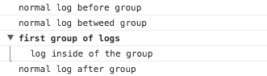
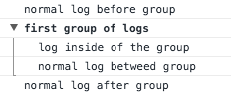

# cnsl
cnsl is a console wrapper library.

It provides not only standard log functions, but additional features like buffered grouped logs.

## Features

### Buffered console groups

When a console group is created with `cnsl.group` or `cnsl.groupCollapsed` a groupped cnsl instance is returned, which buffers all actions until `grpdCnsl.groupEnd` is called.

#### Sample

Groups with cnsl are made like this:

```javascript
cnsl.log('normal log before group');

let grpdCnsl:Cnsl = cnsl.group('first group of logs');

grpdCnsl.log('log inside of the group'); // buffered

cnsl.log('normal log betweed group'); // not buffered

grpdCnsl.groupEnd(); // end of the group, console calls of the group will be processed

cnsl.log('normal log after group');
```

Additionaly the following handling is also possible:

```javascript
cnsl.log('normal log before group');

cnsl.group('first group of logs') // group is created
  .log('log inside of the group'); // buffered

cnsl.log('normal log betweed group'); // not buffered

cnsl.group('first group of logs') // already created group is used
  .groupEnd(); // end of the group, console calls of the group will be processed

cnsl.log('normal log after group');
```

In the browser console it looks like this:



Here is this sample with the "old" implementation:

```javascript
console.log('normal log before group');

console.group('first group of logs');

console.log('log inside of the group');

console.log('normal log betweed group'); // IS ALSO SHOWN INSIDE THE GROUP !!!

console.groupEnd();

console.log('normal log after group');
```

In the browser console it looks like this:



Imagine you are using console groups excessively with nested function calls. You will always have control about where to show an output.

## Planned Features

* log levels for prod environments